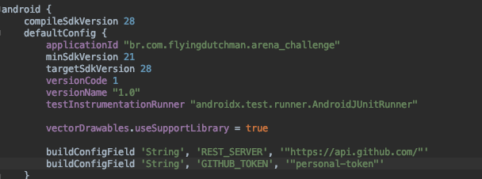

# Criar um aplicativo de consulta a API do [GitHub](https://github.com)#

Criar um aplicativo para consultar a [API do GitHub](https://developer.github.com/v3/) e trazer os repositórios mais populares de Java. Basear-se no mockup fornecido:

### **Deve conter** ###

- __Lista de repositórios__. Exemplo de chamada na API: `https://api.github.com/search/repositories?q=language:Java&sort=stars&page=1`
  * Paginação na tela de lista, com endless scroll / scroll infinito (incrementando o parâmetro `page`).
  * Cada repositório deve exibir Nome do repositório, Descrição do Repositório, Nome / Foto do autor, Número de Stars, Número de Forks
  * Ao tocar em um item, deve levar a lista de Pull Requests do repositório
- __Pull Requests de um repositório__. Exemplo de chamada na API: `https://api.github.com/repos/<criador>/<repositório>/pulls`
  * Cada item da lista deve exibir Nome / Foto do autor do PR, Título do PR, Data do PR e Body do PR
  * Ao tocar em um item, deve abrir no browser a página do Pull Request em questão

### **A solução DEVE conter** ##
* Sistema de build Gradle
* Mapeamento JSON -> Objeto (GSON / Jackson / Moshi / etc)
* Material Design

### **Ganha + pontos se conter** ###

* Framework para comunicação com API
* Testes no projeto (unitários e por tela)
* Testes funcionais (que naveguem pelo aplicativo como casos de uso)
* Cache de imagens e da API
* Suportar mudanças de orientação das telas sem perder estado

### **Sugestões** ###

As sugestões de bibliotecas fornecidas são só um guideline, sintam-se a vontade para usar diferentes e nos surpreenderem. O importante de fato é que os objetivos macros sejam atingidos. =)

* AndroidAnnotations
* Retrofit | Volley | Spring-Android
* Picasso | Universal Image Loader | Glide
* Espresso | Robotium | Robolectric

### **OBS** ###

A foto do mockup é meramente ilustrativa.  

### **Processo de submissão** ###

O candidato deverá implementar a solução e enviar o link do repositório GitHub com a solução.

### **Adicionando personal access token** ###

Quando o token de acesso é commitado e pushado, o Github por segurança remove o token imediatamente , sendo a boa pratica usar o mesmo como variavel de ambiente e não hardcoded no projeto

* [Processo para geração do personal token](https://help.github.com/en/enterprise/2.17/user/github/authenticating-to-github/creating-a-personal-access-token-for-the-command-line)

* [Issue com suposto relatorio do comportamento do Github](https://stackoverflow.com/questions/53579650/github-api-personal-access-token-removes-itself
)
* Substituir  a palavra "personal-token"  dentro do arquivo app/build.gradle na seção pelo token gerado:

### **Melhorias** ###

* Implementação de View EmptyState
* Implementação de Footer com Loading no RecyclerView 
* Implementação de Footer com Error View e botão retry no RecyclerView
* Utilizar Jetpack Paging Library
